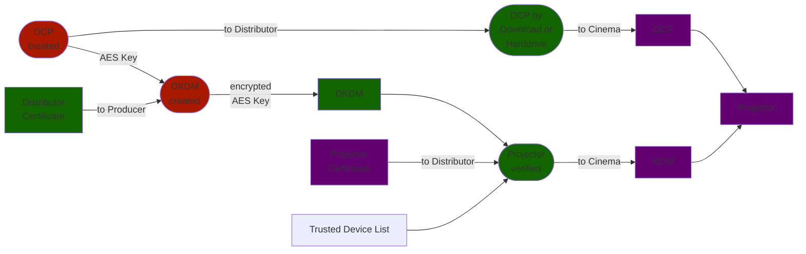
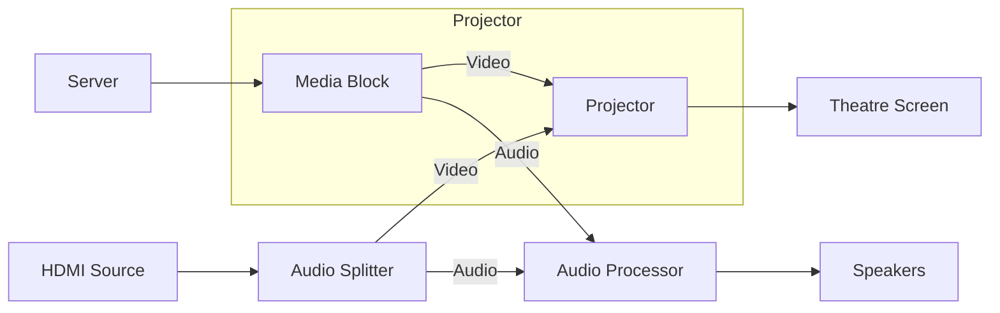
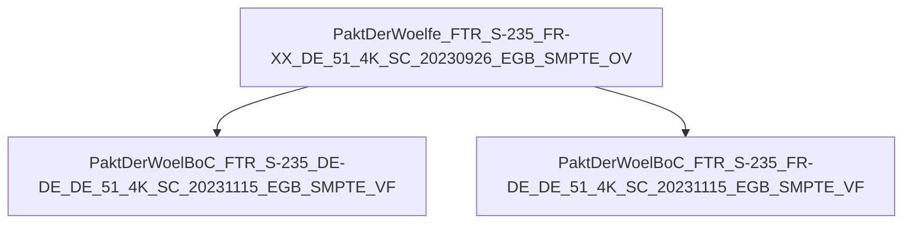
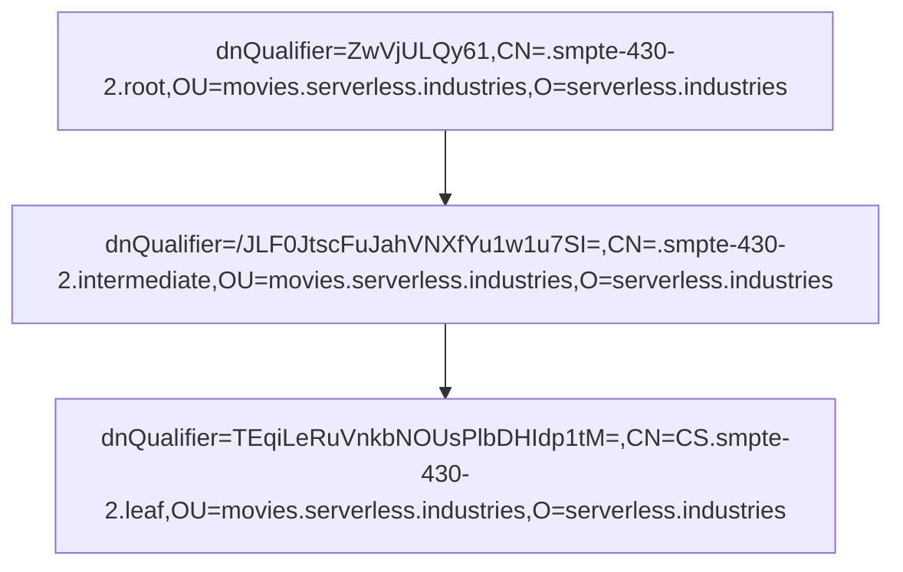

The Cinema Industry is using its own standards for creating and distributing movies in a secure way. The DCI (Digital Cinema Initiatives) specification defines everything from file formats and encryption to the projection systems itself.

The specification itself is [publicly available](https://www.dcimovies.com/) but relies on various IEEE (Institute of Electrical and Electronics Engineers) and SMPTE (Society of Motion Picture and Television Engineers) standards, which have to be purchased.

## Scope

This document will show a rough overview of the DCI workflow and describe in detail how the encryption of a DCI movie works. It will **not** show how to break any encryption and no encryption has been broken while writing this document. **From our perspective, the DCI standard is safe**.

The author of this document has been operating a cinema since 2021, without any insight to the distribution or production side of the industry. Some information may be incomplete.

## How it's started

End of 2023 the movie [WONKA](https://www.imdb.com/title/tt6166392/) was released. Some cinemas reported, that they are unable to start this movie on their projector.

The reason was, that a certificate used by the distributor was expired. This certificate was used to sign the DCP files.

The distributor published new files, starting the movie worked again.

Out of curiosity the author started to check how the validation process on the projector is working.

## Glossar

- **DCP**: Digital Cinema Package - A folder which contains all components of a movie. Metadata, Subtitles, Audio and Picture in seperate files
- **CPL**: Composition Playlist - A DCP can contain multiple audio and video streams which will combined in a CPL
- **KDM**: Key Delivery Message - A XML file which contains the cryptographical information to allow a movie playback on a specific DCI certified projection system
- **DKDM**: Distribution Key Delivery Message - Similar to a KDM, but for a remastering or distribution system, not for a projection system

## Distribution Process




## Projection Systems

Most of the Projection Systems consists of Server, Audio Processor and Projector. 



The Server stores the DCPs and KDMs, manages Playlists and controls the Projector and Audio Processor hardware.

Many Cinemas also connect their Theatre Automation (light, curtains, etc.) to the projector. By setting time-based commands into the playlists, lights and screen curtain can be controlled automatically. The Projector Server provides 12V/24V relays for this.

These time-based commands are also used to set the correct Aspect Ratio and Volume on the different DCPs in a Playlist.

The Server can be controlled remotely by a PC or in larger cinemas by a Theatre Management System.

The DCPs are imported from USB/CRU hard drives or by internet download to the server. They are stored encrypted at all times.

The projector includes a so called "Media Block" which handles DRM and decryption. It receives the DCP data and the KDM to decrypt each frame in real time.

On DCP playback the Projector will send the decrypted PCM audio to the Audio Processor which will then send each processed Audio Channel to the respective Speakers.

{:.img-fluid}

## DCP Format

A DCP is a folder which contains XML metadata files and multiple MXF files for the actual movie.

### Folder Naming Pattern

```txt
AwesomeMovie_FTR-2_S_DE-XX_DE-16_51_4K_20240119_SMPTE_OV
```

- `AwesomeMovie`: A short version of the movie title
- `FTR`: Media Type, in this case "Feature"
- `2`: Version Number
- `S`: Aspect ratio, in this case 2.35:1 aka "Sope"
- `DE`: Audio Language
- `XX`: Subtitle Language, in this case is no subtitle available
- `DE`: Territory
- `16`: Age Rating
- `51`: Audio channels, in this case 5.1 surround sound
- `4K`: Movie resolution, in this case 4096x1716 pixels
- `20240119`: Mastering timestamp
- `SMPTE`: DCP standard, there is also `Interop`
- `OV`: Package type, original version or `VF` for version file

Credits: [http://static.kinofreund.com/dcnt/](http://static.kinofreund.com/dcnt/)

### Mastering Process

During the Mastering Process a static AES 128 bit key is generated and the original medium is converted into MXF files. One for picture and one for audio.

For mastering the tool [DCP-o-matic](https://dcpomatic.com/) can be used. There are also some commercial products.

```mermaid
graph LR
    movie["Source"] --> mastering{{'{{'}}"Movie Mastering"}}
    mastering --> dcpkey["Static<br>AES-128 Key"]
    mastering --> dcp["Digital Cinema Package (DCP)"]
    dcp --> dcppics["Encrypted<br>Picture Data"]
    dcp --> dcpsound["Encrypted<br>Audio Data"]
    dcp --> dcpsub["Encrypted<br>Subtitle Data"]
```

The video stream is encoded as one single JPEG2000 picture per frame. Each frame is encrypted with the same static AES key.

The audio stream is (most likely) chunked into one BWF (Broadcast Wave Format) stream per frame and also encrypted separately. (The author haven't found any information about this yet.)

A DCP can have a size of 200 GB or more. Some newer releases can hit the Terabyte, if multiple versions (Languages, Subtitles, 2D/3D) are shipped on the same harddrive.

The subtitles are provided in an XML file or are burned directly into the picture frames. If it is provided as an XML file, the projector will render the subtitles using a TTF font file.

```xml
<?xml version="1.0" encoding="UTF-8"?>
<DCSubtitle Version="1.0">
    <SubtitleID>xxxxxxxx-xxxx-xxxx-xxxx-xxxxxxxxxxxx</SubtitleID>
    <MovieTitle>MovieTitle</MovieTitle>
    <ReelNumber>1</ReelNumber>
    <Language>de</Language>
    <LoadFont Id="Font1" URI="Arial.ttf" />
    <Font Id="Font1" Color="ffffffff" Effect="border" EffectColor="ff000000" Italic="no" Script="normal" Size="42" Underlined="no" Weight="normal" AspectAdjust="1" Spacing="0em">
        <Subtitle SpotNumber="1" TimeIn="00:07:45:094" TimeOut="00:07:48:000" FadeUpTime="000" FadeDownTime="000">
            <Text HPosition="0" VAlign="bottom" VPosition="7">WÜSTE VON NEVADA - HEUTE</Text>
        </Subtitle>
    </Font>
</DCSubtitle>
```

### Supplemental DCP (VF, Version File)

A supplemental DCP allows to reuse the Original DCP (OV, Original File) picture and replace audio or subtitle tracks. This makes it possible to support different languages without the need of shipping hundreds of gigabytes of duplicated picture data to the cinemas.



Example: One version file for German with German subtitles and one for French with German subtitles.

It is even possible to provide differnt cuts of a movie for different regions.

### Software

Two Open Source C++ implementations, both in active development, one from the industry!

cth103/libdcp, a C++ library written by the makers of DCP-o-matic:

- [https://git.carlh.net/gitweb/?p=dcpomatic.git;a=shortlog](https://git.carlh.net/gitweb/?p=dcpomatic.git;a=shortlog;h=refs/heads/main)
- [https://dcpomatic.com/](https://dcpomatic.com/) ([source code](https://git.carlh.net/gitweb/?p=libdcp.git;a=summary))

asdcplib, a C++ library written by companies active in the cinema industry:

> The asdcplib project was originally exchanged by FTP. The project was on SourceForge between 2005 and 2008, when it moved to a release-only distribution via CineCert. As of late February 2019, its new home is on github.
>
> -- [https://github.com/cinecert/asdcplib](https://github.com/cinecert/asdcplib)

Almost all software, commercial or open source is using one of these libraries.

## Distribution

The symmetric encryption key for the DCP has to be protected in some way. For this, the producer will create a DKDM XML file, containing the AES Key, which has been encrypted with the Certificate Public Key of the distributor.

The distributor can then use the DKDM to create KDM XML files for cinemas. This means decrypting the DCP AES Key and encrypting it again with the Certificate Public Key of the target projection system.

## Certificate Chains

Both projectors and distributors use SSL certificate chains to sign and encrypt/decrypt data.

A chain always consists of a Root Certificate Authority (CA), Intermediate CA and a Leaf Certificate.



The field `dnQualifier` in the subject is the fingerprint of the public key of the generated certificate:

```sh
cat leaf.pem | openssl x509 -pubkey -noout | \
    openssl base64 -d | dd bs=1 skip=24 2>/dev/null | \
    openssl sha1 -binary | openssl base64
```

Script for creating a certificate chain: [create-smpte-chain.sh](https://github.com/NEU-Deli/dcitools/blob/master/create-smpte-chain.sh)

## Key Delivery Messages

A KDM is a XML file which contains the AES key of the DCP encrypted with the projectors Public Key.

- Various XML Schemas: SMPTE 430-1, SMPTE 430-3
- Document signing with XML-DSig
- One or more `<enc:CipherValue>` elements contain the AES keys and some metadata for multiple DCP OV/VF, both encrypted

Decrypt the `<enc:CipherValue>` with `openssl`:

```sh
cat KDM_KaizoTrap_FTR-1_F_XX-XX_20_2K_20240119_SMPTE_OV_My_nonexistent_cinema_Nonexistent_Screen_1.xml | \
    xq -r '.DCinemaSecurityMessage.AuthenticatedPrivate."enc:EncryptedKey"[0]."enc:CipherData"."enc:CipherValue"' | \
    base64 -d | \
    openssl pkeyutl -decrypt -inkey leaf.key -pkeyopt rsa_padding_mode:oaep > kdminfo.bin
```

Output of `hexdump -C kdminfo.bin`:

```txt
00000000  f1 dc 12 44 60 16 9a 0e  85 bc 30 06 42 f8 66 ab  |...D`.....0.B.f.|
00000010  28 fd 80 bf a9 bb f1 dc  48 d9 87 e9 5c c9 a5 41  |(.......H...\..A|
00000020  ab 8e 14 82 88 40 c3 90  2a 0b 46 21 b4 10 49 6b  |.....@..*.F!..Ik|
00000030  b8 a4 a9 4f 4d 44 41 4b  2e 2e 05 b5 bb ed 45 79  |...OMDAK......Ey|
00000040  96 cc 9c d6 00 ed db 4c  32 30 32 34 2d 30 31 2d  |.......L2024-01-|
00000050  32 38 54 31 39 3a 30 30  3a 30 30 2b 30 31 3a 30  |28T19:00:00+01:0|
00000060  30 32 30 32 34 2d 30 32  2d 30 34 54 32 30 3a 30  |02024-02-04T20:0|
00000070  30 3a 30 30 2b 30 31 3a  30 30 4c 3a b6 ed 71 eb  |0:00+01:00L:..q.|
00000080  29 25 90 48 6b 4f 96 2f  44 f6                    |)%.HkO./D.|
0000008a
```

The file can now be sliced into single fields with `dd`:

```sh
# fingerprint base64 encoded
dd if=kdminfo.bin bs=1 skip=16 count=20 status=none | base64

# AES key in hexadecimal
dd if=kdminfo.bin bs=1 skip=122 count=16 status=none | hexdump -C

# date string in plain text ASCII
dd if=kdminfo.bin bs=1 skip=97 count=25 status=none; echo
```

Format:

| Start | Length | Description |
|-------|--------|-------------|
|   0 | 16 | Structure ID, binary, static `0xf1dc124460169a0e85bc300642f866ab` |
|  16 | 20 | Signer certificate fingerprint, binary, `KP2Av6m78dxI2YfpXMmlQauOFII=` |
|  36 | 16 | Composition Playlist UUID, `8840c390-2a0b-4621-b410-496bb8a4a94f` |
|  52 |  4 | Key Type, ASCII, `MDAK` = Main Sound |
|  56 | 16 | Key UUID, `2e2e05b5-bbed-4579-96cc-9cd600eddb4c` |
|  72 | 25 | Not valid before date string, ASCII, `2024-01-28T19:00:00+01:00` |
|  97 | 25 | Not valid after date string, ASCII, `2024-02-04T20:00:00+01:00` |
| 122 | 16 | AES decryption key, binary, `0x4c3ab6ed71eb292590486b4f962f44f6` |
{:.table .table-sm}

- Validate signer certificate: Should match the fingerprint of the leaf certificate used to sign the KDM XML structure

```sh
openssl asn1parse -in leaf.pem -noout -strparse 4 -out - | \
    openssl dgst -sha1 -binary | \
    openssl base64
```

- Validate Composition Playlist UUID: Should appear in the KDM XML field `<CompositionPlaylistId>`
- Validate Key UUID: Should appear in the KDM XML field `<KeyId>`
- Validate Key Type: Should match the type for the respective Key UUID `<TypedKeyId>` block
- Validate Dates: Should appear in the KDM XML fields `<ContentKeysNotValidBefore>` and `<ContentKeysNotValidAfter>`

(This is a subset of checks documented in the [DCI Compliance Test Plan](https://www.dcimovies.com/compliance_test_plan/))

The projector itself has no trusted CA store for validating KDMs or DCPs. The whole process relies on the fingerprint stored in the `<enc:CipherValue>` and that the recipient cinema has no access to the Projectors Private Key.

## Trusted Device List

Could one just build their own DCI/DCP projector?

Yes and no.

The software exists, in theory just a Linux PC and any projector / sound system is required.

The distributors use a so called "Trusted Device List" provided by the DCI certified projection system manufacturers. Projectors which are not mentioned on these lists will not get a DCP/KDM from many distributors.

Also a DCI certified projection system must be installed by an authorized company.

- KDM Request by Serial Number: Many distributors just ask for projector model and serial number. They can query the actual projection system certificate in their distribution system
- KDM Request by Certificate: The cinema has to provide their projector certificate which is then validated against the projection systems manufacturer root certificate

If a cinema is not "playing by the rules", a 30k+ EUR projection system will become an expensive brick.

## MXF File Format

MXF is used by the whole movie and broadcasting industry.

The paper of the SMPTE standard is again purchase-only.

Since the standard is quite complex, the Author used [MXFInspect](https://github.com/Myriadbits/MXFInspect) as a shortcut and only parsed a single Frame / Triplet.

### BER Encoding

**B**asic **E**ncoding **R**ules:

- BER is indicated if the first bit of the byte is a `1`
- Bits 2-8 contain the number of bytes used for the length
- The length bytes contain the length of the data

| BER Indicator | Length | Content |
| ------------- | ------ | ------- |
| `0x83` = `10000011b`<br>= 3 bytes for length | `0x004F0C`<br>= `20236d` | 20236 bytes of data |
{:.table .table-sm}

### Triplet Format (Single Movie Frame)

#### Frame Triplet Structure

| Start | Type | Length | Description |
|-------|------|--------|-------------|
| 0     | DAT  |     16 | Encrypted triplet key |
| 16    | BER  |      1 | BER `0x83` = `10000011b` = Next field is 3 bytes long |
| 17    | LEN  |      3 | `0x004F0C` = `20236d` = Length of the data |
| 20    | BER  |      1 | BER `0x83` = `10000011b` = Next field is 3 bytes long |
| 21    | LEN  |      3 | `0x000010` = `16d` = Length of the next field |
| 24    | DAT  |     16 | Cryptographic Context Link |
| 40    | BER  |      1 | BER `0x83` = `10000011b` = Next field is 3 bytes long |
| 41    | LEN  |      3 | `0x000008` = `8d` = Length of the next field |
| 44    | DAT  |      8 | Plaintext offset |
| 52    | BER  |      1 | BER `0x83` = `10000011b` = Next field is 3 bytes long |
| 53    | LEN  |      3 | `0x000010` = `16d` = Length of the next field |
| 56    | DAT  |     16 | Source Key |
| 72    | BER  |      1 | BER `0x83` = `10000011b` = Next field is 3 bytes long |
| 73    | LEN  |      3 | `0x000008` = `8d` = Length of the next field |
| 76    | DAT  |      8 | Source Length |
| 84    | BER  |      1 | BER `0x83` = `10000011b` = Next field is 3 bytes long |
| 85    | LEN  |      3 | `0x004e90` = `20112d` = Length of the next field |
| 88    | DAT  |  20112 | Encrypted Source Value |
{:.table .table-sm}

<!--
```
Cryptographic Context Link = 2F347C27660A4F87844B36F957D753A6
Plaintext Offset           = 0000000000000000
Source Key                 = 060E2B34010201010D01030115010801
Source Length              = 0000000000004E61 = 20065d
```

> [color=#e862ea] TODO: What are these fields? 🤷‍♂️
--> 

#### Slice the data

```bash
# slice the first frame from the MXF bodypartition
# offsets from MXFInspect
dd if=file.mxf bs=1 count=20256 skip=16524 of=block.bin

# slice data from the frame
dd if=block.bin skip=88 count=20112 bs=1 of=block-encrypted-data.bin
```

### Decrypt Frame Data

The DCP encryption key: `4c3ab6ed71eb292590486b4f962f44f6`

#### The frame IV

Every Frame is using a unique IV (Initialization Vector), which ensures that the AES Block Cipher generates always different cipher texts and makes brute force harder. This works similar to a Password Salt.

```bash
# the data starts with 16 bytes of iv and 16 bytes of cv
# AES iv bytes
dd if=block-encrypted-data.bin bs=1 count=16 of=iv.bin
```

Output of `hexdump -C iv.bin`:

```
00000000  16 6e 7b d1 67 81 44 2e  7a ca de 3c 46 cc d7 39  |.n{.g.D.z..<F..9|
00000010
```

*See also "ECB Penguin" on $searchengine for more details why the IV is so important.*

#### Validate CV

Since there is no way to know if a decryption was successful when the content of the data is unknown, a CV (Check Value) is used. The Check Value is encrypted with the same AES Key + IV, but the plain text value is known.

```bash
# the data starts with 16 bytes of iv and 16 bytes of cv
# AES cv bytes
dd if=block-encrypted-data.bin bs=1 count=16 skip=16 of=cv.bin
```

```bash
cat cv.bin | openssl enc -aes128 -d \
    -K 4c3ab6ed71eb292590486b4f962f44f6 \
    -iv 166e7bd16781442e7acade3c46ccd739 \
    -nosalt -nopad | hexdump -C
```

```
00000000  43 48 55 4b 43 48 55 4b  43 48 55 4b 43 48 55 4b  |CHUKCHUKCHUKCHUK|
00000010
```

If the result matches `0x4348554B4348554B4348554B4348554B` the key is correct.

#### Decrypt data

```bash
# Remove IV and CV from the encrypted data block
dd bs=1 skip=32 \
    if=block-encrypted-data.bin \
    of=block-encrypted-data-nocryptinfo.bin
```

```bash
# Decrypt data block
cat block-encrypted-data-nocryptinfo.bin | \
    openssl enc -aes128 -d \
        -K 4c3ab6ed71eb292590486b4f962f44f6 \
        -iv 166e7bd16781442e7acade3c46ccd739 \
        -nosalt -nopad > block-decrypted-data.bin
```

MXFs created by DCP-o-Matic contain `libdcp` in the hexdump, which indicates that the decryption was successful.

Output of `hexdump -C block-decrypted-data.bin | head`:

```
00000000  3a f0 b7 f5 53 49 eb b7  c0 c0 cb a5 c9 2f 35 19  |:...SI......./5.|
00000010  00 00 00 00 00 00 00 00  00 00 07 ce 00 00 04 38  |...............8|
00000020  00 00 00 00 00 00 00 00  00 03 0b 01 01 0b 01 01  |................|
00000030  0b 01 01 ff 52 00 12 01  04 00 01 01 05 03 03 00  |....R...........|
00000040  00 77 88 88 88 88 88 ff  5c 00 23 22 97 20 96 f0  |.w......\.#". ..|
00000050  96 f0 96 c0 8f 00 8f 00  8e e0 87 50 87 50 87 68  |...........P.P.h|
00000060  70 05 70 05 70 47 77 d3  77 d3 77 62 ff 55 00 13  |p.p.pGw.w.wb.U..|
00000070  00 50 00 00 00 4d 40 00  00 00 00 49 00 00 00 00  |.P...M@....I....|
00000080  49 ff 64 00 0a 00 01 6c  69 62 64 63 70 ff 90 00  |I.d....libdcp...|
00000090  0a 00 00 00 00 4d 40 00  03 ff 93 ef fe 2c 71 ff  |.....M@......,q.|
```

## Magic Signatures

At first, the decrypted Frame could not be opened in GIMP.

To enable programs to open a file in the correct way, many files contain so called "[Magic Signatures](https://en.wikipedia.org/wiki/List_of_file_signatures)" at its beginning.

This magic value in `block-decrypted-data.bin` is incorrect for unknown reasons. When extracting a JPEG2000 frame from an unencrypted MXF, the signature is correct. As a simple hack, the author just copied the signature from the unencrypted MXF frame to the decrypted one:

```bash
# offset again from MXFInspect
dd if=j2c_caa6b39e-bd57-4676-9797-112e96a6f0c3.mxf bs=1 skip=16524 count=20085 of=frame.bin

# unencrypted frame does not contain crypto info
# so we just have to slice the first BER header
dd if=framedata.bin.j2k bs=1 skip=20 count=16 of=j2k_header.bin

# now back to the decrypted mxf frame
# replace signature
cp j2k_header.bin frame.j2k
dd if=block-decrypted-data.bin bs=1 skip=16 >> image.j2k
```

It should now be possible to open the file in GIMP. GIMP will show the frame with wrong colors, as MXF files use a custom color space.

{:.img-fluid}

The original Frame with correct colors:

{:.img-fluid}

Credit: [Kaizo Trap by Guy Collins Animation](https://www.youtube.com/watch?v=lIES3ii-IOg)

## Why it's safe

Everything relies on "never reusing AES Keys" and "protected private keys".

- KDM data is encrypted with a 2048 bit RSA key
- MXF data is encrypted with AES-128
- Decryption keys are always stored in TPM-like hardware
- Every DCP uses unique encryption keys
- Every projector uses unique certificates/keys
- A DCI certified projector is required
- Distributors can verify if a certificate belongs to a certified DCI projector

{:.img-fluid}

Source: [xkcd.com/538/](https://xkcd.com/538/)

## Just record it

Encrypted DCPs use [Forensic Watermarks][watermarks] which contain the serial number of the
projection system. So if a recorded copy of a movie appears online, the theatre will have to answer
serious questions and may never get movies again.

Pirated copies of movies have it's origin most likely from other sources.

## How it's going

DCI has released version 1.4.4 of the [specification](https://www.dcimovies.com/specification/), which now allows playback of DCPs with expired signer certificate. 

The manufacturers already started to work on a software update.

## Sources

- [DCI Specification](https://www.dcimovies.com/specification/index.html)
- [DCI Compliance Test Plan](https://www.dcimovies.com/compliance_test_plan/)
- [OpenSSL Foo](https://marc.info/?l=openssl-users&m=114884533706459&w=2)
- [Key Types](https://github.com/wolfgangw/digital_cinema_tools_distribution/blob/master/cinemaslides#L1737)
- [DC Tools by WolfgangW](https://github.com/wolfgangw/digital_cinema_tools_distribution/tree/master)
- [MXFInspect](https://github.com/Myriadbits/MXFInspect)
- [MXF Triplets](https://tech.ebu.ch/docs/techreview/trev_2010-Q3_MXF-2.pdf)
- [SMPTE Standard](https://web.archive.org/web/20201103045630id_/https://ieeexplore.ieee.org/ielx7/8984679/8984680/08984681.pdf)
- [MXF Triplet Encryption](https://interop-docs.cinepedia.com/Document_Release_2.0/mpeg_ii_track_file_encryption.pdf)
- [Showing jpeg2000 in Gimp / parsing jpeg2000 data from mxf](https://github.com/cth103/libdcp/issues/11)
- [List of magic signatures](https://en.wikipedia.org/wiki/List_of_file_signatures)
- [Forensic Watermarks in DCPs][watermarks]

[watermarks]: https://dcpomatic.com/forum/viewtopic.php?t=2372

## Credits

Thanks for reading and feedback goes to: Pliskin, babel

There are alot of comments on [Hacker News](https://news.ycombinator.com/item?id=43745281).
