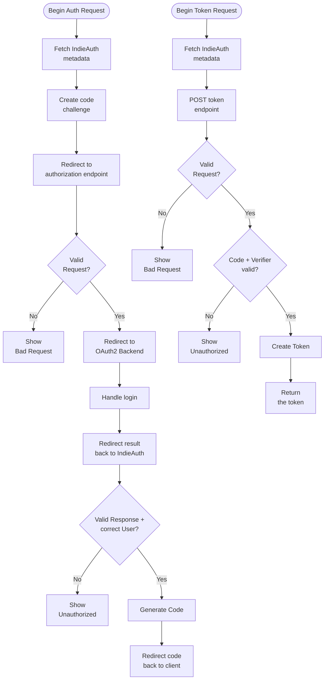

A lot of services of the IndieWeb are using Web Sign-in to authenticate a user. Web Sign-in uses the 
personal website domain as identity. There is no requirement for having a E-Mail address or 
a Social Media Account.

[Web Sign-in](https://microformats.org/wiki/web-sign-in) describes only that there should be a text 
field where a website URL is entered, but has no authentication mechanism whatsoever. This 
requires RelMeAuth or IndieAuth as addons.

## Level 1: Just use it

The IndieWeb Community offers with [indielogin.com](https://indielogin.com/) a service, which 
allows it as a user to use Web Sign-in with the RelMeAuth workflow without any additional coding.

[RelMeAuth](https://microformats.org/wiki/RelMeAuth) uses hyperlinks marked with the HTML 
attribute `rel="me"` to choose an authentication provider. Once the website URL is entered 
and the "Login" button is clicked, the authentication provider will fetch the website and search 
for such hyperlinks. 

```html
<a href="https://github.com/perryflynn" rel="me">my GitHub</a>`
```

The GitHub profile **must** also contain a backlink to your website. 

It depends on the RelMeAuth provider which login methods are supported. indielogin.com also supports 
`mailto:` hyperlinks to send a one time password (OTP) as proof of identity/ownership.

[indiewebify.me](https://indiewebify.me/) and [indielogin.com](https://indielogin.com/) can be used 
to test if everything was set up correctly.

## Level 2: Build your own IndieAuth endpoint

A website can also handle the authentication all on its own. Then it has to provide 
IndieAuth [authorization and token endpoints](https://indieauth.spec.indieweb.org/#discovery-by-clients) 
in HTML head or in HTTP header.

```html
<link rel="indieauth-metadata" href="https://intercom.serverless.industries/auth/relme/metadata">
```

The given URL points to a [metadata JSON document](https://indieauth.spec.indieweb.org/#indieauth-server-metadata) 
which contains all necessary URLs and settings. Before this metadata endpoint was part of the 
specification, there were also two dedicated link tags which may also added to the website for 
compatibility to older implementations.

```html
<link rel="authorization_endpoint" href="https://intercom.serverless.industries/auth/relme/auth">
<link rel="token_endpoint" href="https://intercom.serverless.industries/auth/relme/token">
```

If a IndieAuth client detects an authentication endpoint, it redirects the authentication request 
to that endpoint. It is up to the endpoint, how exactly the authentication is happening. It could 
be a classic user and password prompt, a one time password (OTP) or a redirect to a OAuth2 service.

[indielogin.com](https://indielogin.com/) will redirect to the authentication endpoint as well
instead of using RelMeAuth.

I chose to use my personal GitLab instance as a OpenID/OAuth2 provider and let GitLab
handle all the login and MFA things for me.

### Technical overview of the workflow

The IndieAuth workflow with more details and a lot of links to the specification:

- 🤔 [Fetch metadata endpoint](https://indieauth.spec.indieweb.org/#discovery) or use legacy 
  endpoint URLs mentioned in website head/header
- 🚀 [Start authentication](https://indieauth.spec.indieweb.org/#authorization-request) against 
  the `authorization_endpoint` with the following query parameters (very similar to OAuth2):
	- `me`: Your website address
	- `code_challenge_method`: Fixed to `S256`, aka SHA256
	- `code_challenge`: A random string hashed with SHA256 (see below)
	- `response_type`: Fixed to `code`
	- `redirect_uri`: URL of the client to receive authentication result
	- `client_id`:  The URL of the client
	- `state`: Parameter to prevent CSRF attacks, client MUST only accept one `state` value 
      one time on `redirect_uri` endpoint
	- `scope`: Requested permissions, something like `profile create update delete`

SHA256 hash algorithm in PHP is used by the client to generate `code_challenge`:

```php
$binHash = hash('sha256', $codeVerifier, true);
$mode = SODIUM_BASE64_VARIANT_URLSAFE_NO_PADDING;
return sodium_bin2base64($binHash, $mode);
```

The client must store the plain text value of the random string for retrieving the 
authentication result later.

- 🔐 Store the request information in a session or database and redirect to the OpenID/OAuth2 
  backend. I use my personal GitLab instance for that purpose.
- 🔓 Receive callback from OpenID/OAuth2 backend
- 🔎 Check if received identity matches the IndieAuth request
	- Profile information should contain the `me` website address
	- The IndieAuth provider could use a `users` database table to check username/user 
      ID/E-Mail/user status, but that's optional
- ✍ Create the response code, a random string which is valid for ten minutes to retrieve 
  a token from the `token_endpoint`, store that together with the original `code_challenge`, 
  `client_id` and `redirect_uri` in a database table
- 📮 [Redirect back to the client](https://indieauth.spec.indieweb.org/#authorization-response) 
  using `redirect_uri` and the following query parameters:
	- `code`: The code generated in the previous step
	- `state`: The state parameter received in the original authentication request
	- `iis`: The base URL of the IndieAuth provider
- 🔎 The client must now check if `state` exists in it's session storage and mark it as used. 
  Also it must check if `state` and `iis` match the previously started request to prevent abuse.
- 🎫 If the received response is valid from the clients perspective, there are now 
  [two options to redeem the retrieved code](https://indieauth.spec.indieweb.org/#redeeming-the-authorization-code):
	- Retrieve profile Information
	- Retrieve a authentication token and profile Information

Both requests send the following parameters in a form urlencoded POST request:

- `grant_type`: Fixed to `authorization_code`
- `code`: The code received by the authentication flow
- `client_id`:  The URL of the client
- `redirect_uri`: URL of the client to receive authentication result
- `code_verifier`: The plain text value of the `code_challenge`

**🤔 Why so complicated? Why not just return the token in the first redirect back to the application!?**

There can be a unknown number of redirects between the IndieAuth provider and the client. 
If the client is a Smartphone App, there can be a wrapper in between as Apps don't have 
a `http://` URL to redirect to. 

Decouple the authentication and redeeming the actual token ensures that only the client will 
ever have access to the token.

- 🔎 For both options, the IndieAuth provider will 
  [check all the parameters](https://indieauth.spec.indieweb.org/#redeeming-the-authorization-code) 
  against the code database table entries. Also the provider is using the same PHP snippet as the 
  client to hash the plain text `code_verifier` and compare it against the stored `code_challenge`.

```php
// calculate hash from request parameter
$binHash = hash('sha256', $_POST['code_verifier'], true);
$mode = SODIUM_BASE64_VARIANT_URLSAFE_NO_PADDING;
$codeVerifier = sodium_bin2base64($binHash, $mode);
// compare against value in database
$codeChallenge = $databaseRow['code_challenge'];
return hash_equals($codeChallenge, $codeVerifier);
```

- 🔑 If all request parameters including the `code_verifier` are valid, the IndieAuth provider 
  will now invalidate the code entry to prevent replay attacks and return the 
  [profile Information](https://indieauth.spec.indieweb.org/#profile-url-response) or 
  [a token](https://indieauth.spec.indieweb.org/#access-token-response).

**On all requests the IndieAuth provider MUST check the parameters very carefully and must ensure, that timeouts or expirations are not reached.**

### Flowchart

The full IndieAuth workflow as a flow chart:



### Does a client need a token?

Only if the IndieAuth provider / API provides additional features. Otherwise it is completly
sufficient to redeem the authorization code for retrieving the profile information without
any token.

## Level 3: RelMeAuth and own IndieAuth provider

If your service should be used by many users, it makes sense to allow the users to choose 
themselves which authentication backend should be used. 

So instead of redirecting always to that one single OpenID/Oauth2 backend, the IndieAuth provider 
could also parse the users website and check for `rel=me` hyperlinks like described in Level 1.

I didn't implemented that so I cannot provide an example.

## Further Infos

There are additional optional endpoints:

- `introspection_endpoint`: Returns details of a token
- `userinfo_endpoint`: Returns user details
- `revocation_endpoint`: Invalidate a token

Specification:

- [indieauth.spec.indieweb.org](https://indieauth.spec.indieweb.org/)
- [Old way to use token endpoint to check if a token is valid](https://indieweb.org/token-endpoint)

Some services which implementing IndieAuth:

- [indiebookclub is a simple app for tracking books you are reading](https://indiebookclub.biz)
- [Artemis is a calm web reader](https://artemis.jamesg.blog/)
- [Micropublish is a Micropub client](https://micropublish.net/)
- [An IndieWeb Webring](https://xn--sr8hvo.ws/)

Syndicate: [news.indieweb.org](https://news.indieweb.org/en){:.u-syndication}
