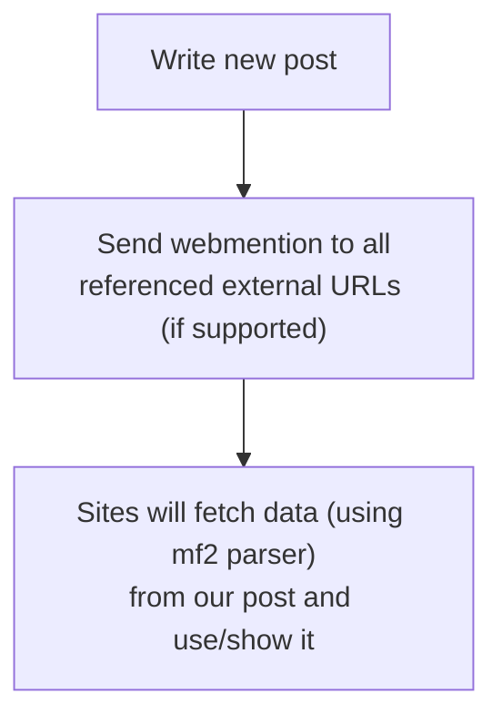

One of the goals of [the IndieWeb][indieweb] is to be independent from centralized platforms 
without losing contact to friends. Besides of the [POSSE][posse] principle the IndieWeb community
uses [Microformats2][mf2] to create structured data with HTML and [Webmentions][webmention] 
to communicate with other websites.

[indieweb]: 
[posse]: https://indieweb.org/POSSE
[webmention]: https://indieweb.org/Webmention
[mf2]: https://microformats.org/

## Microformats

Microformats are just CSS classes. They are used to mark/annotate specific elements in the HTML 
code of your site to make informations parsable by machines. The main elements used are
[h-entry][hentry] and [h-card][hcard].

A `h-entry` is similar to a `<article>` tag and contains a blog post or an article.
A `h-card` contains information about a person or a company. If a site is scraped, a parser
like [php-mf2][parser] is used to extract information out of the HTML.

There is also [h-feed][hfeed] which can be used as an alternative to dedicated RSS feed files,
as [do not repeat yourself][dry] is also part of the IndieWeb principles.

```html
<article class="h-entry" lang="en">
    <h1 class="p-name">Webmentions: Exchange data between websites</h1>

    <p>
        <time class="dt-published" datetime="2025-06-14">14. June 2025</time>·
        <a class="p-author h-card" href="/people/christian.html">christian</a>·
        Tags:
        <a class="p-category" href="/tag/indieweb.html">indieweb</a>, 
        <a class="p-category" href="/tag/world-wide-web.html">world wide web</a>
    </p>

    <div class="e-content">
        <p>One of the goals of...</p>
    </div>
</article>
```

[Demo of the parsers output](https://php.microformats.io/?url=https%3A%2F%2Fserverless.industries%2F2024%2F05%2F31%2Fdigital-cinema.en.html)

Take a look into the source code of this page to see how it looks like.

[hentry]: https://microformats.org/wiki/h-entry
[hcard]: https://microformats.org/wiki/h-card
[hfeed]: https://microformats.org/wiki/h-feed
[parser]: https://github.com/microformats/php-mf2
[dry]: https://indieweb.org/DRY

## Webmentions

Webmention is the successor of [Trackback][trackback] and [Pingback][pingback]. It does not transfer
any data. It sends a notification to a websites endpoint, that website will fetch
the senders URL and is searching for backlinks and microformats.

[trackback]: https://en.wikipedia.org/wiki/Trackback
[pingback]: https://en.wikipedia.org/wiki/Pingback

A websites webmention endpoint is annotated via HTML head or HTTP header:

```html
<link rel="webmention" href="https://intercom.serverless.industries/webmentions/endpoint">
```

A webmention request looks like so:

```
POST /webmentions/endpoint HTTP/1.1
Host: intercom.serverless.industries
Content-Type: application/x-www-form-urlencoded

source=https://serverless.industries/2024/05/31/dci-talk-gpn22.html&
target=https://serverless.industries/2024/05/31/digital-cinema.en.html
```

It is up to the receiving website which information is used and which not. Microformats `h-entry`
supports bookmarks, likes, comments, replies, and many more. Even a RSVP for an event can be sent
via webmention and microformats.



## Security Considerations

As always, content from other website cannot be trusted!

- Received mentions should be processed asynchronous and rate limited 
  to prevent abuse for DoS/DDoS attacks
- To reduce SPAM the Webmention Endpoint should always check if a backlink 
  to the receiving site exists
- Before embedding comments or other received content to the own site, it
  should be checked for malicious HTML

## Using it

[webmention.io](https://webmention.io/) is a web service ran by the IndieWeb community to
"just use it" on own website without writing much code. There is also 
[a plugin](https://de.wordpress.org/plugins/webmention/) for Wordpress.

If you want to build it yourself, there are mf2 parsers for 
[many coding languages](https://microformats.org/wiki/microformats2#Parsers) available, which
makes it trivial to write a fetch mechanism.

## Further Info

- [The microformats wiki](https://microformats.org/wiki/Main_Page)
- [The official specification](https://www.w3.org/TR/webmention/) for webmention
- [webmention.rocks](https://webmention.rocks/) is a test suite for webmentions
- Test h-cards with [indiewebify.me](https://indiewebify.me/)
- [Artemis](https://artemis.jamesg.blog/) is a web reader which uses mf2 feeds

Syndicate: [news.indieweb.org](https://news.indieweb.org/en){:.u-syndication}
